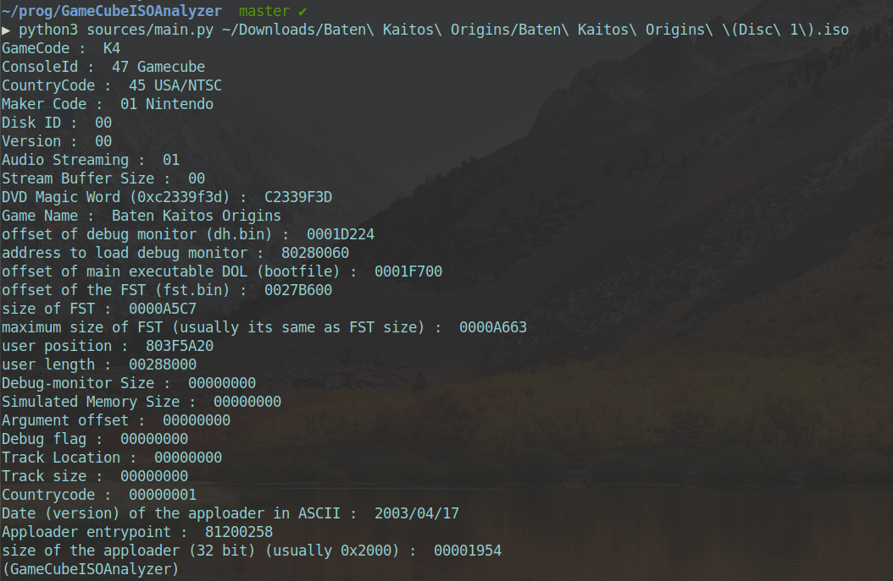

# GameCubeISOAnalyzer
GameCube ISO Analyzer for Windows, Linux and MacOS

## Usage
    - python3 sources/main.py [ISO]

For register in file

    - python3 sources/main.py [ISO] > [OUTPUT]

## Inpired by

- https://www.romhacking.net/utilities/1167/
- http://hitmen.c02.at/files/yagcd/yagcd/chap13.html
